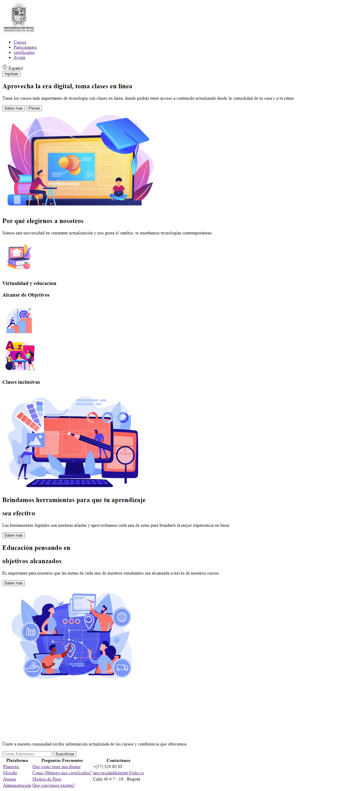

<h1>Taller # 9 - David Ricaurte</h1>
    <h2>Información</h2>
    
Curso Full Stack Basico - Grupo 1

     
Profesor: Cristian Patiño

    <h2>Punto 1: Link de Figma</h2>
    <a href="https://www.figma.com/file/9v9J0q0tmjyeBE1n1NknAE/JuanD?type=design&node-id=0-1&t=edqOaUKaao6eKNWR-0">Link de Figma</a>
    <h2>Punto 2: Link de Figma</h2>
    